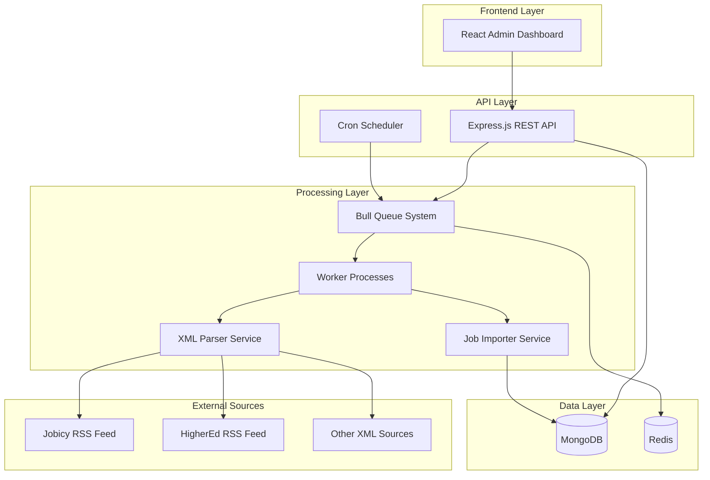

# Job Import System Architecture

## Overview

The Job Import System is designed as a scalable, microservices-oriented application that handles the automated import of job listings from multiple external XML/RSS feeds. The system emphasizes reliability, monitoring, and real-time processing capabilities.

## System Architecture



## Component Details

### 1. Frontend Layer (React Dashboard)

**Purpose**: Provides a comprehensive admin interface for monitoring and managing job imports.

**Key Features**:
- Real-time import statistics and queue monitoring
- Import history with detailed logs and filtering
- Manual import triggering capabilities
- Source performance analytics
- Responsive design with modern UI components

**Technology Stack**:
- React 18 with TypeScript
- Tailwind CSS for styling
- Lucide React for icons
- Real-time data fetching with automatic refresh

### 2. API Layer (Express.js)

**Purpose**: Serves as the central communication hub between the frontend and backend services.

**Key Components**:
- **REST API Server**: Handles HTTP requests and responses
- **Cron Scheduler**: Manages automated import scheduling
- **Route Handlers**: Organized endpoints for different functionalities

**Endpoints**:
```
/api/health              - System health check
/api/jobs/*              - Job data management
/api/imports/*           - Import management and monitoring
/api/imports/queue/*     - Queue statistics and control
```

### 3. Processing Layer

#### Queue System (Bull + Redis)
**Purpose**: Manages job processing with reliability and scalability.

**Features**:
- Job queuing with priority support
- Retry logic with exponential backoff
- Concurrency control
- Job progress tracking
- Failed job management

**Configuration**:
```javascript
{
  concurrency: 5,           // Configurable worker count
  attempts: 3,              // Retry attempts
  backoff: 'exponential',   // Retry strategy
  removeOnComplete: 100,    // Job cleanup
  removeOnFail: 50         // Failed job retention
}
```

#### Worker Processes
**Purpose**: Execute the actual job import logic in isolated processes.

**Responsibilities**:
- Fetch XML data from external sources
- Parse and transform job data
- Store/update jobs in MongoDB
- Log import results and errors
- Handle failures gracefully

#### XML Parser Service
**Purpose**: Converts various XML/RSS formats to standardized JSON.

**Supported Formats**:
- RSS 2.0 feeds
- Atom feeds
- Custom job XML schemas

**Transformation Logic**:
- Extracts job details (title, company, location, etc.)
- Normalizes data formats
- Handles missing or malformed data
- Generates unique external IDs

#### Job Importer Service
**Purpose**: Manages the complete import workflow.

**Process Flow**:
1. Fetch XML data from source URL
2. Parse XML to JSON format
3. Extract and validate job data
4. Batch process jobs for efficiency
5. Upsert jobs in MongoDB (insert new, update existing)
6. Log import results and statistics

### 4. Data Layer

#### MongoDB
**Purpose**: Primary data store for jobs and import logs.

**Collections**:
- **jobs**: Job listings with full details
- **importlogs**: Import history and statistics

**Key Indexes**:
```javascript
// Jobs collection
{ externalId: 1, sourceUrl: 1 }  // Unique constraint
{ company: 1, title: 1 }         // Search optimization
{ publishedDate: -1 }            // Chronological queries

// Import logs collection
{ timestamp: -1 }                // Recent imports
{ sourceUrl: 1, timestamp: -1 }  // Source-specific history
```

#### Redis
**Purpose**: Queue storage and caching layer.

**Usage**:
- Job queue persistence
- Worker coordination
- Temporary data caching
- Session management (future use)

## Data Flow

### 1. Scheduled Import Flow
```
Cron Scheduler → Queue Jobs → Workers → XML Parser → Job Importer → MongoDB
                                                                  ↓
                                                            Import Logs
```

### 2. Manual Import Flow
```
Admin UI → API Endpoint → Queue Jobs → Workers → Processing → Results → UI Update
```

### 3. Monitoring Flow
```
Admin UI → API Endpoints → MongoDB Queries → Statistics → Real-time Display
```

## Scalability Considerations

### Horizontal Scaling
- **Worker Processes**: Can be distributed across multiple servers
- **API Servers**: Stateless design allows load balancing
- **Database**: MongoDB supports sharding for large datasets
- **Queue**: Redis clustering for high availability

### Performance Optimizations
- **Batch Processing**: Jobs processed in configurable batches
- **Connection Pooling**: Efficient database connections
- **Caching**: Redis caching for frequently accessed data
- **Indexing**: Optimized database indexes for common queries

### Resource Management
- **Memory**: Configurable batch sizes prevent memory overflow
- **CPU**: Adjustable worker concurrency based on server capacity
- **Network**: Timeout configurations for external API calls
- **Storage**: Automatic cleanup of old queue jobs

## Error Handling & Reliability

### Retry Mechanisms
- **Exponential Backoff**: Failed jobs retry with increasing delays
- **Maximum Attempts**: Configurable retry limits
- **Dead Letter Queue**: Permanently failed jobs for manual review

### Monitoring & Alerting
- **Health Checks**: API endpoint for system status
- **Queue Monitoring**: Real-time queue statistics
- **Error Logging**: Comprehensive error tracking and reporting
- **Performance Metrics**: Processing times and success rates

### Data Integrity
- **Unique Constraints**: Prevent duplicate job entries
- **Validation**: Input validation at multiple layers
- **Transactions**: Atomic operations where applicable
- **Backup Strategy**: Regular database backups (recommended)

## Security Considerations

### API Security
- **CORS Configuration**: Controlled cross-origin access
- **Input Validation**: Sanitization of all inputs
- **Rate Limiting**: Protection against abuse (recommended)
- **Authentication**: JWT-based auth (future enhancement)

### Data Protection
- **Environment Variables**: Sensitive configuration externalized
- **Connection Security**: Encrypted database connections
- **Access Control**: Role-based permissions (future enhancement)

## Configuration Management

### Environment-Based Configuration
```env
# Core Settings
NODE_ENV=production
PORT=5000

# Database
MONGODB_URI=mongodb://localhost:27017/job-import-system
REDIS_URL=redis://localhost:6379

# Processing
IMPORT_INTERVAL_HOURS=1
BATCH_SIZE=50
WORKER_CONCURRENCY=5

# Sources
JOB_SOURCES=url1,url2,url3
```

### Runtime Configuration
- **Dynamic Source Management**: Add/remove sources without restart
- **Queue Configuration**: Adjust processing parameters
- **Monitoring Settings**: Configurable refresh intervals

## Deployment Architecture

### Development Environment
```
Local Machine:
├── Frontend (React Dev Server) :3000
├── Backend API (Express) :5000
├── Worker Process (Node.js)
├── MongoDB (Local/Docker)
└── Redis (Local/Docker)
```

### Production Environment
```
Cloud Infrastructure:
├── Frontend (CDN/Static Hosting)
├── API Servers (Load Balanced)
├── Worker Instances (Auto-scaling)
├── MongoDB Atlas (Managed)
├── Redis Cloud (Managed)
└── Monitoring (Logs/Metrics)
```

## Future Enhancements

### Planned Features
1. **Real-time Updates**: WebSocket integration for live dashboard updates
2. **Advanced Analytics**: Machine learning for job categorization
3. **Multi-tenant Support**: Support for multiple organizations
4. **API Rate Limiting**: Enhanced security and resource protection
5. **Notification System**: Email/Slack alerts for import failures
6. **Data Export**: CSV/Excel export functionality
7. **Advanced Filtering**: Complex search and filter capabilities

### Technical Improvements
1. **Microservices**: Split into smaller, independent services
2. **Container Orchestration**: Kubernetes deployment
3. **Message Streaming**: Apache Kafka for high-throughput scenarios
4. **Caching Layer**: Advanced caching strategies
5. **Testing**: Comprehensive test coverage
6. **Documentation**: API documentation with OpenAPI/Swagger

## Assumptions & Limitations

### Current Assumptions
1. **XML Format Stability**: External APIs maintain consistent XML structure
2. **Network Reliability**: Stable internet connection for API calls
3. **Resource Availability**: Sufficient server resources for processing
4. **Data Volume**: Current design handles up to 100K jobs efficiently

### Known Limitations
1. **Single Database**: No built-in database failover
2. **Memory Usage**: Large XML files may cause memory issues
3. **Error Recovery**: Limited automatic error recovery mechanisms
4. **Real-time Updates**: Dashboard updates on refresh, not real-time

### Mitigation Strategies
1. **Monitoring**: Comprehensive logging and alerting
2. **Graceful Degradation**: System continues with partial failures
3. **Resource Limits**: Configurable limits prevent resource exhaustion
4. **Documentation**: Clear troubleshooting guides

---

This architecture provides a solid foundation for a scalable job import system while maintaining flexibility for future enhancements and requirements.